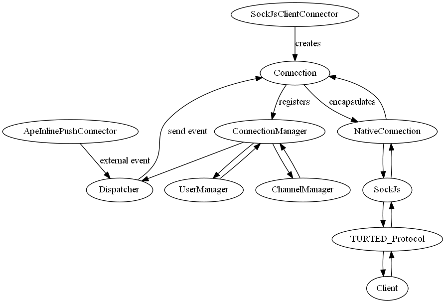

TURTED_node
===========

node.js implementation of a universal real time event dispatcher

Basic idea:
-----------
Create an abstraction protocol for handling real time connections to push events from server to client.
Users can log in and join channels so the server can push messages to selected clients (via username or channel)

Example (work in progress, but that's roughly what I want to end up with):

*PHP Server*
```php
$targets = array("users" => "xosofox", "channels"=>array("chat","chatlog"));
$data = array("msg" => "What... is the Airspeed Velocity of an Unladen Swallow?", "from" => "Bridgekeeper"); 
$turted->emit("MESSAGE:NEW",$targets, $data);
```

Client Javascript
```javascript
var turted = new TURTED("http://example.com");
turted.on("MESSAGE:NEW", function(data) {
  $('#chat').append("<p><b>"+data.from+"</b>: "+data.msg+"</p>");
});
```

Heavily inspired by the work of the http://ape-project.org and based on my implementations back in 2011 on this topic
(see http://de.slideshare.net/Xosofox/real-time-event-dispatcher)



Why?
----
It looks like the first thing everybody implements when playing with nodejs and sock.js is a basic chat application, but I did not really find a library out there taking the load of the dev when you need a little bit more funtionality.

Especially handling channels and providing a clean and operational client interface while managing users is the target of this project.

What else?
----------
This is my first node.js project, so I wanted to give it a spin even if I'm re-inventing some wheels or violate agains
the NIH principle.
And also, if I don't do stuff "the node way", I apologize. Just let me know.
It also might be that I'm "over-engineering" the whole thing. As said, it's also meant for playing with stuff like node unit tests, trying to stick to a strict SOLID principle, etc... comments and recommendations are welcome!!!


[](https://travis-ci.org/TURTED/TURTED_node)

#Glossary#
Since TURTED is intended to dispatch/emit events from any arbitrary backend app via a central server to many clients, we have three parties included:
* the backend app (PHP, Java, ...)
* the TURTED server for handling real-time connections (node.js or ape)
* the clients (browsers, connected via websocket or any other connection allowing push data)

For each of these connections, data needs to follow certain structures.
*All data is encoded using JSON*

#Protocol#
##Backend to Server
##Server to Client
##Client to Server

#Connectors#
##Client to Server
* sock.js

##Backend to Server
* ApeInlinePushConnector (for compatibility)
* Redis Pub/Sub (close future plan)
* RabbitMQ (far future plan)
