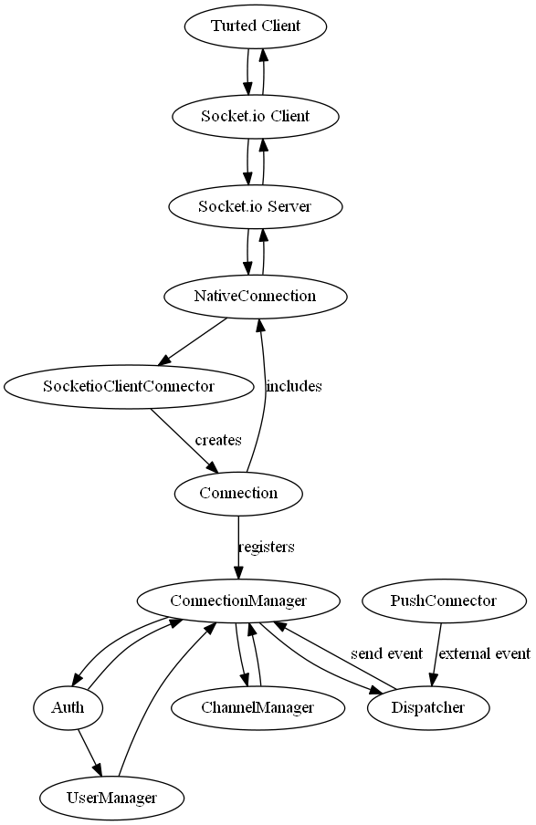

TURTED_node
===========

node.js implementation of a universal real time event dispatcher

Basic idea:
-----------
Create an abstraction protocol for handling real time connections to push events from server to client.
Users can log in and join channels so the server can push messages to selected clients (via username or channel)


Example (work in progress, but that's roughly what we want to end up with):

*PHP Server*
```php
$targets = array("users" => "xosofox", "channels"=>array("chat","chatlog"));
$data = array("msg" => "What... is the Airspeed Velocity of an Unladen Swallow?", "from" => "Bridgekeeper"); 
$turted->emit("MESSAGE:NEW",$targets, $data);
```

Client Javascript
```javascript
var turted = new TURTED("http://example.com");
turted.on("MESSAGE:NEW", function(data) {
  $('#chat').append("<p><b>"+data.from+"</b>: "+data.msg+"</p>");
});
```

Heavily inspired by the work of the http://ape-project.org and based on my implementations back in 2011 on this topic
(see http://de.slideshare.net/Xosofox/real-time-event-dispatcher)



Why?
----
It looks like the first thing everybody implements when playing with nodejs and sock.js is a basic chat application, but we did not really find a library out there taking the load of the dev when you need a little bit more funtionality.

Especially handling channels and providing a clean and operational client interface while **managing users** is the target of this project.

[](https://travis-ci.org/TURTED/TURTED_node)

#Glossary#
Since TURTED is intended to dispatch/emit events from any arbitrary backend app via a central server to many clients, we have three parties included:
* the backend app (PHP, Java, ...)
* the TURTED server for handling real-time connections (node.js)
* the clients (browsers, connected via websocket/socket.io/sockjs or any other connection allowing push data)

#Internal Handling#
To allow for different transports, the idea is to abstract the underlying framework (socket.io, sockjs, ...)
So all connections between the TURTED client and TURTED server are layers on top of the used transport.
To achieve this, all native connections (socket.io, sockjs, ...) are encapsulated into a "Connection" with a clear interface.
All interactions need to be translated by the Connection to and from the native connection.

#Protocol#
##Backend to Server
notifyUser (username, eventname, payload)
notifyChannel (channelname, eventname, payload)
notify(array(channels, users), eventname, payload)
##Client to Server
* ident(dataForAuth)
```javascript
  examples: turted.ident({username:"foo", password: "bar"});
  examples: turted.ident({username:"foo", token: "h57dlot8"});
```
On the server side, an "Authenticator" will be needed to handle the data and verify the username/password or user/token provided. This can be any object that implements a ```verify``` method and can return true or false based on the data it received
    
* join(channelname)
* leave(channelname)

##Server to Client
* event

#Connectors
##Client to Server
* ~~sock.js~~
* socket.io

##Backend to Server (PushConnector)
* RestPushConnector, receiving an HTTP POST request
* Redis Pub/Sub (future plan)
* RabbitMQ (far future plan)
* FileTailConnector (to be considered for live-logging)

##Usage
Logging:
~~You can use  '''npm config set turted:loglevel "debug"''' to change the loglevel to debug.~~

Listening to dispatched events on the TURTED server:
The dispatcher emits all events it emits to the clients as a node event, so
dispatcher.on("nameOfTheEvent", function() { console.log("It happened") });
can help creating custom functionality on the server

##TODO List
* Add a "via" collection to Dispatch (like connId: {"user": "adam" } or connId: {"channel": "chat"}) and pass this to the client to inform "why" he got this push by giving some context. Note to self: add during "Now I'm dispatching it"
